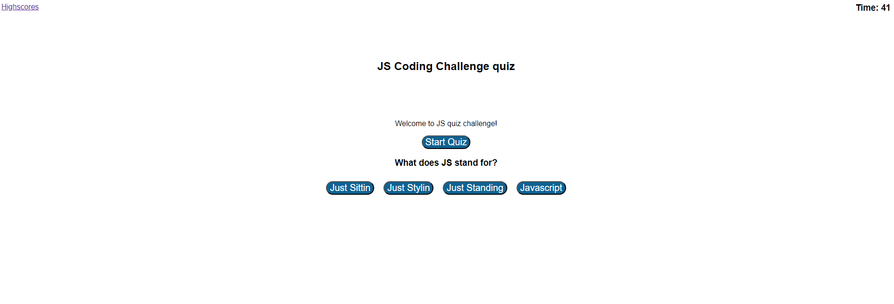

## JavaScript Quiz Web App
This is a JavaScript Quiz Web App that allows users to test their knowledge of JavaScript fundamentals. The app presents multiple-choice questions and tracks the user's score. It also provides a timer to add a time constraint to the quiz.

### Features
Multiple-choice questions: The app presents a series of multiple-choice questions related to JavaScript.

Timer: The app includes a timer that counts down from a specified time limit. The quiz ends when the timer reaches zero.

Score tracking: The app keeps track of the user's score based on the number of correct answers.

High scores: The app stores and displays the highest scores achieved by users.

### Installation
To use the JavaScript Quiz Web App, follow these steps:

Clone the repository from GitHub.

Open the project in your preferred code editor.

Run index.html in a web browser.

### Usage
Open the JavaScript Quiz Web App in a web browser.

Click the "Start Quiz" button to begin the quiz.

Read each question and select the correct answer from the multiple-choice options.

The timer will start counting down from the specified time limit.

After answering all the questions or when the timer reaches zero, the quiz will end.

The app will display the user's score and provide an option to view the high scores.

### Technologies Used 
The JavaScript Quiz Web App is built using the following technologies:

HTML: Used for the structure and layout of the web app.

CSS: Used for styling and visual enhancements.

JavaScript: Used for the logic and interactivity of the quiz.

### Future Development
Here are some possible future enhancements for the JavaScript Quiz Web App:

Add more questions: Expand the question bank to provide a larger variety of questions.

Different difficulty levels: Implement different difficulty levels for the quiz, allowing users to choose their preferred level.

User authentication: Add user authentication to track individual scores and allow users to compete with others.

Share scores: Provide an option for users to share their scores on social media platforms.

### License
This project is licensed under the MIT License.